# CONSOLE UYGULAMASI
## Vektörel kursta yaptığım 1. proje
 
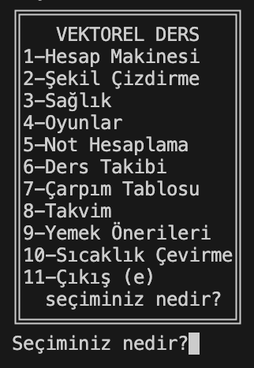
Uygulamayı açtığımızda bu ekran bizi karşılamakta.
 
İstediğimiz uygulamaya başındaki numarayı yazarak yönlendiriliyoruz.
 
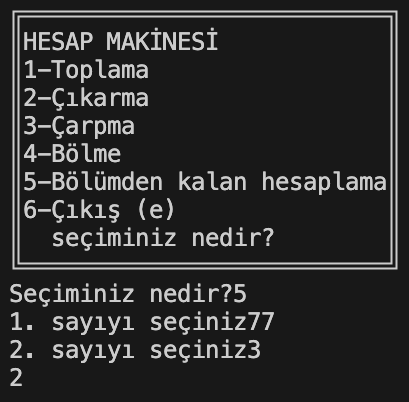
1 numaraya basarak hesap makinesine ulaşabiliyoruz! Karşımıza çıkan hesap makinesinden de istediğimiz işlemi numaralarına göre seçip istediğimiz işlemi yaptırabiliriz. Örneğin 5 numaralı işlemi yukarıdaki fotoğraftan görebilirsiniz.
 
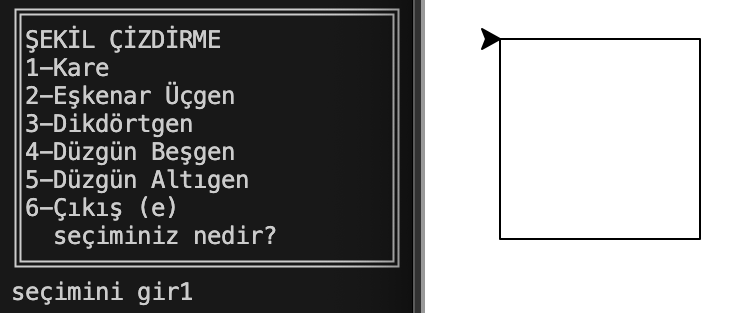
2 numaraya basarak çizdirebileceğimiz şekillerin olduğu ekrana ulaşıyoruz! Tekrardan istediğimiz şekli numaralarına göre seçip çizdirebiliriz. Örneğin 1 numaralı kareyi yukarıdaki fotoğraftan görebilirsiniz.
 
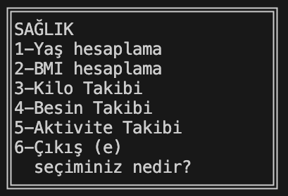
3 numaraya basarak sağlık adlı ekrana ulaşıyoruz!
 
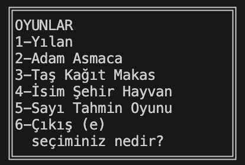
4 numaraya basarak oyunlara ulaşabiliyoruz!
 
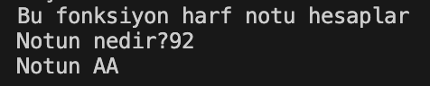
5 numaraya basarak notlarımızı harf notu yapan uygulamaya ulaşabiliyoruz! Örneğin yukarıdaki fotoğraf, 92'nin AA'ya karşılık geldiğini göstermiştir.
 
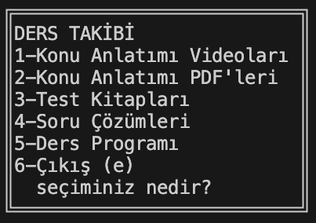
6 numaraya basarak ders takibi ekranına ulaşabiliyoruz! 
 
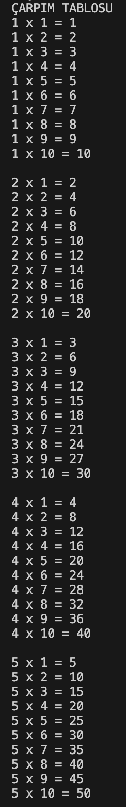
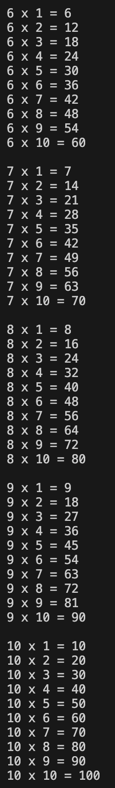
7 numaraya basarak çarpım tablosuna ulaşabiliyoruz! 1'den 10'a kadar olan sayıların hepsini gruplayıp çarpım şeklinde göstermektedir.
 
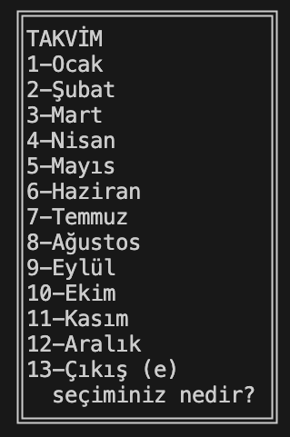
8 numaraya basarak takvime ulaşabiliyoruz!
 
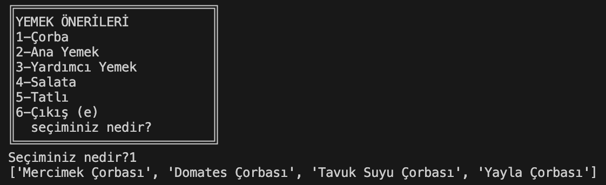
9 numaraya basarak yemek önerilerine ulaşabiliyoruz! Karşımıza çıkan seçeneklerden hangisiyle ilgili öneri/örnek istiyorsak o numarayı seçtiğimizde karşımıza seçilen seçeneğin örneklerini çıkarmaktadır. Örneğin 1 numaralı çorba önerilerini yukarıdaki fotoğraftan görebilirsiniz.
 
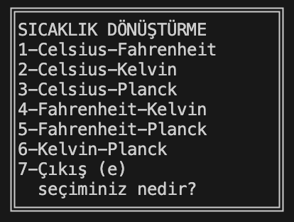
10 numaraya basarak sıcaklık çevirme ekranına ulaşabiliyoruz! 
